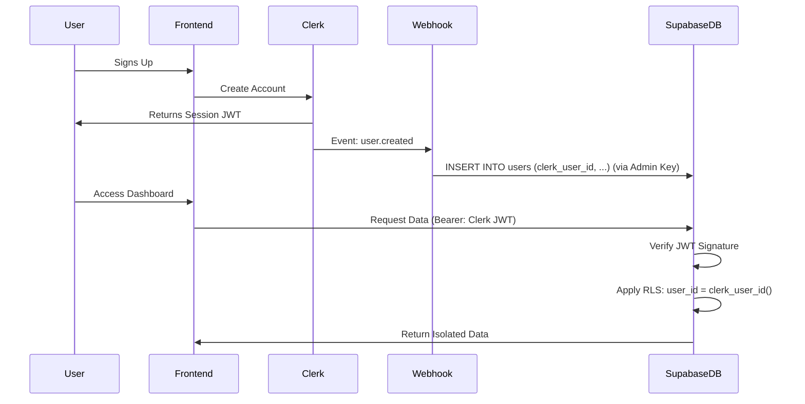
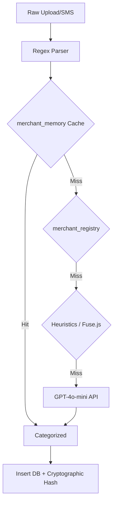
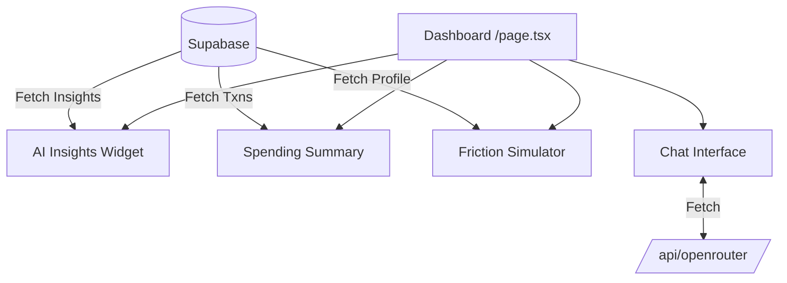

# Current State of FinTrac Codebase

## Section 1 — Executive Summary

**Product Description:** FinTrac is a friction-aware, AI-driven behavioral finance application. It moves away from static, punitive budgeting by introducing an Elastic Savings Engine that dynamically routes recommended spending cuts based on user-specific psychological "friction" profiles, adapting through reinforcement-inspired feedback loops.

**Current Maturity Level:** Prototype / Alpha. The core AI heuristics, database schemas, authentication flows, and initial dashboards are built. Academic simulations of the model (Python) validate the theory. The frontend application is functional but lacks some integration polish and real-world data pipelines (like live bank sync).

**Main Capabilities:**
- Federated Authentication (Clerk + Supabase RLS).
- PDF Bank Statement & SMS Ingestion parsers.
- 8-Stage Hybrid Transaction Classification (Regex -> Cache -> DB -> Heuristics -> Fuse.js -> GPT-4o-mini).
- Elastic Adaptive Savings Engine with adaptive friction-learning weights.
- Cryptographic Audit Ledger for transactions.
- Simulated friction environments (Dashboard UI).

**Core Technology Stack:**
- **Frontend:** Next.js 14 (App Router), React, Tailwind CSS, Radix UI, Recharts.
- **Backend:** Next.js Server Components / API Routes, Inngest (Serverless events).
- **Database:** Supabase (PostgreSQL) with Row Level Security.
- **AI/ML:** OpenRouter (GPT-4o-mini), custom TS heuristics, Python Monte Carlo simulation suite.
- **Auth:** Clerk.

**Deployment Architecture:**
- Frontend & APIs: Vercel (target).
- Database: Supabase.
- Background Jobs: Inngest.

---

## Section 2 — Repository Structure

```
/
├── research                 # Python Monte Carlo simulations & reproducibility scripts
├── src
│   ├── app                  # Next.js App Router root
│   │   ├── (auth)           # Clerk auth routes (sign-in, sign-up)
│   │   ├── api              # Backend API routes & Inngest handlers
│   │   └── dashboard        # Protected application routes & pages
│   ├── assets               # Static assets
│   ├── components           # Reusable React components (UI, layout, features)
│   │   ├── dashboard        # Complex widgets specific to the dashboard
│   │   └── ui               # Base Radix UI components (shadcn/ui style)
│   ├── contexts             # React Context providers (Theme, Budget, Transaction)
│   ├── hooks                # Custom React hooks
│   ├── lib                  # Core backend logic & utilities
│   │   ├── ai               # Classification, behavioral intel, Elastic Savings Engine
│   │   ├── ingestion        # File upload and chunking logic
│   │   ├── jobs             # Inngest function definitions
│   │   ├── normalization    # Transaction string cleaners
│   │   ├── parsers          # PDF & CSV statement parsers
│   │   ├── storage          # Supabase storage interactions
│   │   └── supabase         # Supabase client initializers (server & admin)
│   ├── services             # External API integrations (OpenRouter, SMS sync)
│   └── utils                # Helper functions (blockchain, formatting)
├── supabase
│   └── migrations           # PostgreSQL schema, RLS, and trigger definitions
└── scripts                  # Utility scripts (e.g., directory tree generator)
```

**Purpose & Responsibilities:**
- `src/app`: Handles routing, server-side data fetching, and API endpoints.
- `src/lib/ai`: Contains the proprietary IP (friction learning, elastic engine, behavioral intel).
- `supabase/migrations`: Source of truth for database schema and security.
- `research`: Contains the academic validation framework for the AI model.

---

## Section 3 — Frontend Architecture

### Routing

**Public Routes:**
- `/` - Landing Page
- `/sign-in/*` - Clerk Login
- `/sign-up/*` - Clerk Registration

**Protected Routes (under `/dashboard`):**
- `/dashboard` - Main metrics overview, wellness audit.
- `/dashboard/savings-optimizer` - Savings simulators, categorical gauges.
- `/dashboard/budgets` - Budget breakdown and friction simulator.
- `/dashboard/transactions` - Ledger, manual entry, categorization overrides.
- `/dashboard/chatbot` - AI assistant chat interface.
- `/dashboard/ai-analysis` - Insight and behavior reports.
- `/dashboard/cards`, `/dashboard/mentors`, `/dashboard/settings`, `/dashboard/security`, `/dashboard/invest`, `/dashboard/support` - Scaffolding / partially implemented.

### Components

**Major Components:**
- **`FrictionSimulator`** (`src/components/dashboard/FrictionSimulator.tsx`)
  - **Purpose:** Interactive UI allowing users to adjust behavioral friction and simulate how the Elastic Engine reallocates budget cuts.
  - **Props:** Initial category stats.
  - **Dependencies:** Recharts, Radix UI slider, custom AI lib functions.
  - **Status:** Fully implemented.
- **`TransactionUpload`** (`src/components/dashboard/TransactionUpload.tsx`)
  - **Purpose:** Handles PDF/CSV file uploads for bank statements.
  - **Dependencies:** React Dropzone (implied/native), backend `/api/ingestion/upload`.
  - **Status:** Implemented (UI and chunking).
- **`AIInsights`** (`src/components/dashboard/AIInsights.tsx`)
  - **Purpose:** Renders behavioral alerts and wellness scores.
  - **Dependencies:** Database fetch of `ai_insights`.
  - **Status:** Implemented.
- **`InsightExplainabilityModal`** (`src/components/dashboard/InsightExplainabilityModal.tsx`)
  - **Purpose:** Provides transparency into why AI generated a specific insight (math & triggers).
  - **Status:** Implemented.
- **`ChatInterface`** (`src/components/dashboard/ChatInterface.tsx`)
  - **Purpose:** Chatbot UI.
  - **Dependencies:** API route `/api/openrouter`.
  - **Status:** Implemented.

### State Management

- **Context Providers:**
  - `ThemeContext`: Dark/Light mode management.
  - `BudgetContext`: Global budget state.
  - `TransactionContext`: Global transaction cache.
- **Local State:** Extensive use of React `useState` and `useReducer` for complex widgets like the Friction Simulator.
- **Server State:** Handled natively via Next.js Server Components passing props to Client Components, augmented with occasional direct `fetch` calls in client side hooks.

---

## Section 4 — Backend Architecture

### API Routes

**`POST /api/webhooks/clerk`**
- **Purpose:** Syncs newly created/updated Clerk users into the Supabase `public.users` table.
- **Auth Requirements:** Svix Webhook Signature validation.

**`GET /api/transactions`**
- **Purpose:** Fetch paginated transactions for the authenticated user.
- **Input:** `limit`, `type`, `category` (query params).
- **Output:** JSON array of transactions joined with categories.
- **Auth Requirements:** Valid Clerk session.

**`POST /api/transactions`**
- **Purpose:** Insert a manual transaction.
- **Input:** `merchant`, `amount`, `type`, `category`, `date`, `description`, `upi_id`.
- **Output:** Created transaction JSON.
- **Auth Requirements:** Valid Clerk session.

**`POST /api/transactions/correct`**
- **Purpose:** Allows user to correct an AI categorization, updating local memory.
- **Input:** Transaction ID, new category ID.
- **Auth Requirements:** Valid Clerk session.

**`POST /api/ingestion/upload`** & **`POST /api/ingestion/chunk`**
- **Purpose:** Handles large file uploads for statement parsing.
- **Auth Requirements:** Valid Clerk session.

**`POST /api/insights/generate`**
- **Purpose:** Triggers behavioral insight generation manually or post-upload.
- **Auth Requirements:** Valid Clerk session.

**`POST /api/openrouter`**
- **Purpose:** Proxies chat messages to GPT-4o-mini.
- **Auth Requirements:** Valid Clerk session.

**`POST /api/inngest`**
- **Purpose:** Webhook endpoint for Inngest background job execution.
- **Auth Requirements:** Inngest signature.

### Services (Lib modules)

- **`elasticSavingsEngine.ts`**
  - **Responsibility:** Distributes targeted savings cuts using an iterative water-filling algorithm based on friction scores.
- **`updateFrictionWeights.ts`**
  - **Responsibility:** Calculates compliance ratios and applies the adaptive learning rule to update user friction scores.
- **`classifierPipeline.ts`**
  - **Responsibility:** 8-stage transaction categorization engine.
- **`behavioralIntel.ts`**
  - **Responsibility:** Calculates wellness scores and generates heuristic alerts (Spikes, Drifts).

---

## Section 5 — Database Documentation

Database: PostgreSQL (Supabase)

### Tables

**`users`**
- **Purpose:** Core user identity mapped from Clerk.
- **Columns:** `id` (TEXT, PK), `email` (TEXT, UQ), `full_name` (TEXT), `avatar_url` (TEXT), `currency` (VARCHAR), `created_at`.
- **RLS:** Users can view/update own profile.

**`categories`**
- **Purpose:** System and user-defined transaction categories.
- **Columns:** `id` (UUID, PK), `user_id` (TEXT, NULL=Global), `name` (TEXT), `type` (ENUM), `icon` (TEXT), `color` (TEXT).
- **RLS:** Users can view global and own, manage own.

**`transactions`**
- **Purpose:** Financial ledger.
- **Columns:** `id` (UUID, PK), `user_id` (TEXT, FK), `category_id` (UUID, FK), `amount` (DECIMAL), `type` (ENUM), `status` (ENUM), `merchant_name` (TEXT), `date` (TIMESTAMPTZ), `ai_confidence_score` (DECIMAL), `blockchain_hash` (TEXT, UQ).
- **RLS:** Full isolation to `clerk_user_id()`.

**`behavioral_profiles`**
- **Purpose:** Stores user personas and adaptive friction matrices.
- **Columns:** `id` (UUID, PK), `user_id` (TEXT, FK), `persona_type` (TEXT), `friction_scores` (JSONB), `failure_streaks` (JSONB), `compliance_streaks` (JSONB), `updated_at`.
- **RLS:** Isolated to `clerk_user_id()`.

**`historical_budgets`**
- **Purpose:** Logs monthly recommended cuts to evaluate compliance later.
- **Columns:** `id` (UUID), `user_id` (TEXT), `category` (TEXT), `month_date` (DATE), `budget_limit` (DECIMAL), `suggested_cut` (DECIMAL).
- **RLS:** Isolated to `clerk_user_id()`.

**`merchant_memory` / `merchant_registry`**
- **Purpose:** User-specific overrides and global merchant categorization cache.

**`ai_insights`**
- **Purpose:** Stores generated behavioral alerts.

**`blockchain_records`**
- **Purpose:** Append-only cryptographic ledger of transactions.

**`sms_logs`, `bank_statements`, `uploaded_files`, `audit_logs`**
- **Purpose:** Raw ingestion data and systemic logging.

### Functions & Triggers
- **`clerk_user_id()`:** SQL STABLE function extracting `sub` from the JWT.
- **`process_audit_ledger()`:** Trigger on `transactions` computing SHA-256 chain hash.

---

## Section 6 — Authentication & Authorization

- **Identity Provider:** Clerk.
- **Database Provider:** Supabase.
- **Integration Pattern:** No-proxy JWT injection. Clerk issues a session JWT containing the user's `sub`. Supabase intercepts this token. Row Level Security policies call `public.clerk_user_id()` to securely restrict data access.

### Flow Diagram



---

## Section 7 — Transaction Intelligence System

**Current Ingestion Pipeline:**
1. **SMS Import:** Extracted via regex (`smsSyncService.ts`), stripping UPI VPAs and isolating UTRs.
2. **Statement Import:** PDF/CSV uploaded via `TransactionUpload.tsx`, chunked, and parsed iteratively using regex boundary detection.

**Classification Engine (8-Stage Hybrid):**
1. String Cleaner.
2. User Local Cache (`merchant_memory`).
3. Global Registry (`merchant_registry`).
4. Heuristic Keywords.
5. Fuzzy Match (Fuse.js).
6. GPT-4o-mini Fallback.
7. Default "Other".
8. Feedback Loop (User Correction).



---

## Section 8 — AI & Recommendation Systems

### Implemented

- **8-Stage Classifier:** Categorizes raw transactions (Custom Logic + OpenRouter GPT-4o-mini).
- **Elastic Savings Engine:** Mathematical allocation of budget cuts based on friction weights (`elasticSavingsEngine.ts`).
- **Adaptive Friction-Learning Updates:** Monthly compliance evaluator adjusting friction matrices (`updateFrictionWeights.ts`).
- **Behavioral Heuristics:** Spending Spike, Category Drift, Late-Night impulse alerts (`behavioralIntel.ts`).
- **AI Financial Chatbot:** Conversational assistant integrated via OpenRouter (`ChatInterface.tsx`).

### Partially Implemented

- **AI Coaching Engine:** Summarizes *why* cuts were made. Skeleton exists (`coachingEngine.ts`) but deep UI integration is pending.

### Planned Only (Not Implemented)

- Fully autonomous investment routing.
- Advanced predictive forecasting based on macroeconomic trends.

---

## Section 9 — Goal Management

**Status:** Not Yet Implemented / UI Mockup Only.
- There are no database tables specifically for Goal CRUD in the initial migrations (`00001` to `00014`).
- `SavingsGoals.tsx` exists as a UI component but operates on placeholder data or derived context, lacking a dedicated backend schema for progress tracking and contribution logging.

---

## Section 10 — Forecasting Features

**Status:** Not Yet Implemented.
- The platform features *simulations* (e.g., `FrictionSimulator.tsx`) showing immediate static math distributions.
- There is no temporal forecasting engine implemented in the codebase (no predictive time-series models for future balance estimation).

---

## Section 11 — Dashboard Architecture

**Current Dashboard Widgets:**
- **AI Insights Panel:** Displays generated heuristic alerts. Sourced from `ai_insights` table.
- **Spending Summary:** Visualizes current month outlays. Sourced from `transactions`.
- **Friction Simulator:** Interactive tabs for budget allocation based on friction. Computes state locally in React based on initial profile fetch.
- **Chat Interface:** Chatbot component. Client-side state calling `/api/openrouter`.



---

## Section 12 — External Integrations

| Integration | Purpose | Location in Code | Dependencies |
|---|---|---|---|
| **Clerk** | Authentication & Session JWT | `middleware.ts`, `api/webhooks/clerk`, UI | `@clerk/nextjs` |
| **Supabase** | DB, Auth Verification, Storage | `src/lib/supabase/*` | `@supabase/supabase-js`, `@supabase/ssr` |
| **OpenRouter** | LLM Provider (GPT-4o-mini) | `api/openrouter`, `aiClassifier.ts` | `fetch` (REST) |
| **Inngest** | Serverless background jobs | `src/lib/jobs/*`, `api/inngest` | `inngest` |

---

## Section 13 — Environment Variables

| Variable | Required | Purpose | Used By |
|---|---|---|---|
| `NEXT_PUBLIC_CLERK_PUBLISHABLE_KEY` | Yes | Clerk frontend auth | Clerk Provider |
| `CLERK_SECRET_KEY` | Yes | Clerk backend validation | Clerk Server API |
| `CLERK_WEBHOOK_SECRET` | Yes | Verify user.created events | Webhook Route |
| `NEXT_PUBLIC_SUPABASE_URL` | Yes | DB endpoint | Supabase Clients |
| `NEXT_PUBLIC_SUPABASE_ANON_KEY` | Yes | Public DB access | Supabase Clients |
| `SUPABASE_SERVICE_ROLE_KEY` | Yes | Admin DB bypass | Webhooks, Inngest |
| `OPENROUTER_API_KEY` | Yes | LLM generation | OpenRouter API calls |
| `INNGEST_EVENT_KEY` | Yes | Send events to Inngest | Inngest Client |
| `INNGEST_SIGNING_KEY` | Yes | Secure Inngest endpoints | Inngest API Route |

---

## Section 14 — Data Flow Diagrams

*(See sections 6, 7, and 11 for specific flow diagrams).*

---

## Section 15 — Current Feature Inventory

### Fully Implemented
- Federated JWT Auth (Clerk + Supabase RLS).
- Cryptographic Audit Ledger triggers.
- 8-Stage Hybrid Transaction Classification.
- Elastic Savings Engine (Mathematical core).
- Adaptive Friction-Learning Updates (Cron Job).
- Bank Statement Regex Parser.
- Academic Validation Simulation Suite (Python).
- Base Dashboard UI & Liquidmorphism design system.

### Partially Implemented
- AI Coaching Explanations (Logic exists, UI pending).
- SMS Ingestion (Logic exists, Android app client integration required).
- File Chunking Upload (API exists, edge case handling pending).

### Not Yet Implemented
- Savings Goal CRUD schemas.
- Advanced Time-Series Forecasting.
- Subscription Cancellation automation.
- Live Plaid / Aggregator Bank Sync (relies wholly on manual / PDF import currently).

---

## Section 16 — Technical Debt

- **Missing Validation:** API routes lack robust Zod schemas for incoming request validation.
- **Mock Data:** Some dashboard pages (like `/cards`, `/invest`) are essentially UI placeholders.
- **Test Coverage:** While RL engine heuristics have 13 deterministic unit tests (`runFrictionUpdatesTests.ts`), there is zero frontend or E2E test coverage (Playwright/Cypress).
- **Incomplete Services:** SMS Sync relies on an external Capacitor/Android client that isn't fully represented in the Next.js mono-repo logic.
- **Architectural Issues:** The reliance on OpenRouter without robust retry mechanisms or circuit breakers could cause classification pipeline failures if the LLM provider experiences downtime.

---

## Section 17 — Production Readiness Assessment

| Area | Score | Reasoning |
|---|---|---|
| **Authentication** | 9/10 | Clerk + Supabase RLS via JWT is highly secure and robust. |
| **Database** | 8/10 | RLS policies are tight, blockchain ledger ensures integrity. |
| **Security** | 8/10 | Webhook signatures verified, RLS enforced. Needs API rate limiting. |
| **Performance** | 7/10 | Classification pipeline is fast due to caching, but heavy PDF parsing on Vercel serverless may hit timeouts. |
| **Scalability** | 8/10 | Inngest background jobs successfully decouple heavy workloads from request-response cycles. |
| **Observability** | 4/10 | Lacks Sentry, Datadog, or OpenTelemetry integration. |
| **Testing** | 3/10 | Strong algorithmic unit tests, but no UI/integration tests. |
| **Deployment** | 7/10 | Ready for Vercel, but CI/CD pipeline (GitHub Actions) is missing. |

---

## Section 18 — Gap Analysis Against Vision

| Feature | Current Status | Implemented % | Missing Components |
|---|---|---|---|
| **Command Center** | Functional Dashboard | 60% | Live bank sync, goal tracking. |
| **Goal OS** | Not Implemented | 5% | DB schemas, contribution logic, UI. |
| **Recommendation Engine** | Active | 90% | Elastic engine and friction updates are fully built. |
| **Forecasting Engine** | Not Implemented | 0% | Predictive models, time-series DB, visualization. |
| **Explainability Layer** | Active | 80% | "Why this insight" modals exist and render mathematical inputs. |

---

## Section 19 — Build Readiness Matrix

| System | Current Status | Readiness % | Blocking Issues |
|---|---|---|---|
| Auth & DB | Production Ready | 100% | None. |
| AI Core | Production Ready | 95% | None. |
| Ingestion | Beta | 70% | PDF parser may choke on unstructured bank layouts. |
| Frontend | Alpha | 60% | Placeholder pages, missing Zod validation on forms. |
| Infra | Development | 50% | Needs CI/CD, rate limiting, error tracking (Sentry). |

---

## Section 20 — Final Architecture Summary

FinTrac today is a highly sophisticated, mathematically rigorous prototype. The core intellectual property—the **Adaptive Friction-Learning Engine** and the **8-Stage Classification Pipeline**—are fully built, tested, and implemented in the repository, supported by a secure Clerk + Supabase RLS architecture.

However, the application is currently a "headless brain". It possesses exceptional processing capability for transactions and budgeting logic but lacks real-world, automated ingestion (no live bank sync API like Plaid). Furthermore, while the AI insights and friction simulators are built, supplementary user features like Savings Goal tracking and Forecasting do not exist in code.

**What should be built next:**
1. Robust API Input Validation (Zod).
2. Savings Goals Database Schemas and UI.
3. Observability (Sentry) and CI/CD pipelines.
4. Plaid/Live Banking Integration to replace the reliance on PDF statement uploads.
