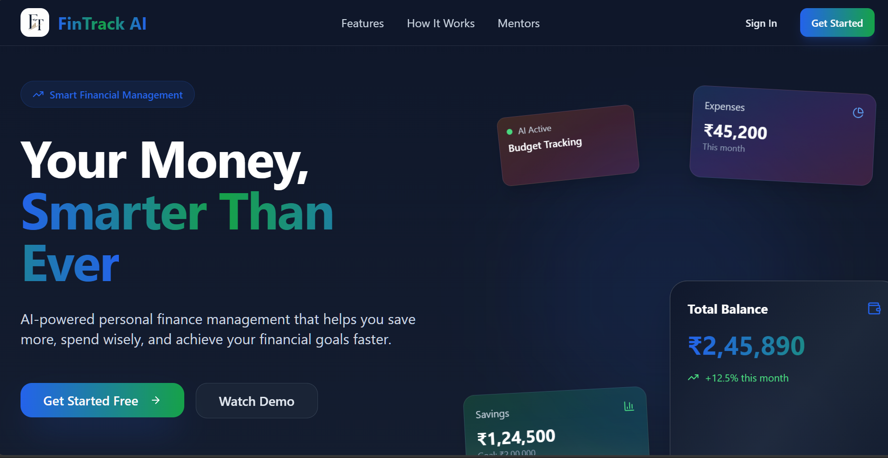
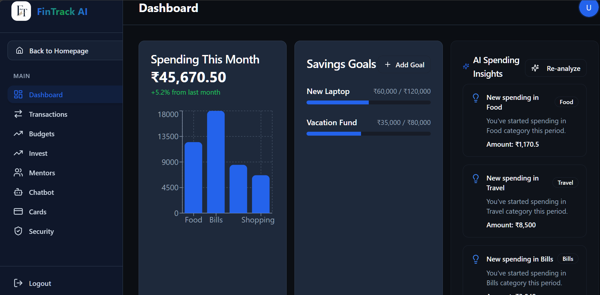
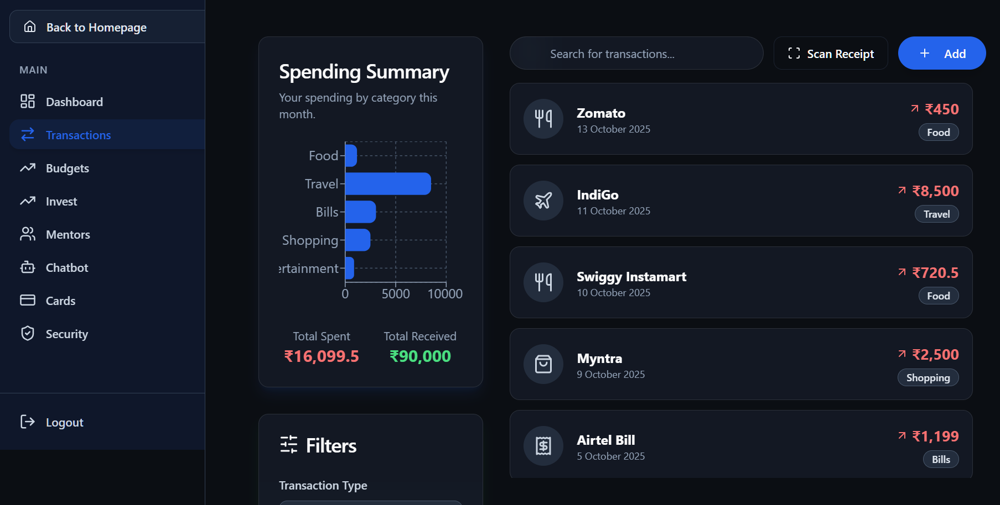
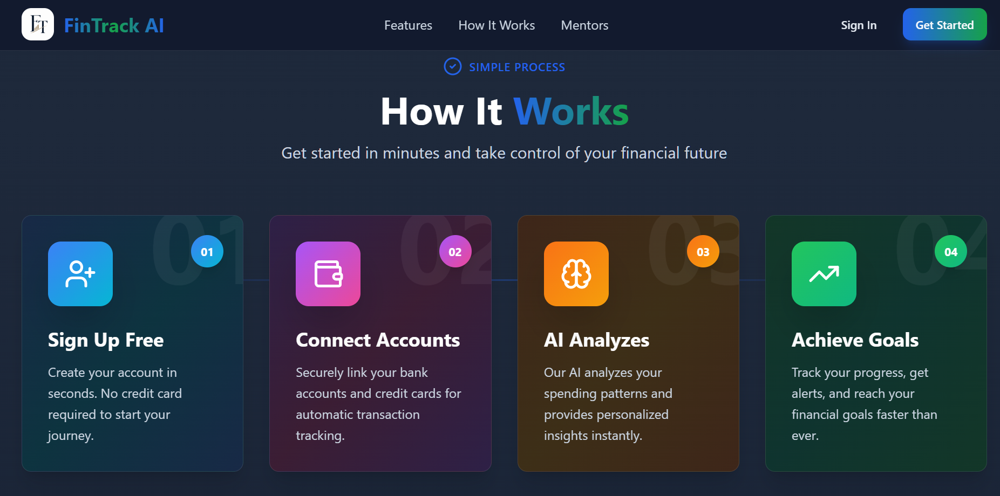

# FinTrac AI Landing

A modern AI-powered financial analytics landing page built with Vite, React, TypeScript, and Tailwind CSS.
The project focuses on creating a premium, responsive user experience with clean UI architecture, reusable components, and scalable frontend design patterns.

---

## Live Demo

[Deployment Link](https://fintrac-ai-landing.vercel.app/)

---

## Overview

FinTrac AI Landing is designed as a high-performance SaaS-style landing page and dashboard experience for an AI-driven financial intelligence platform. The application showcases predictive analytics, financial insights, and modern product-focused UI/UX practices.

The goal of this project was to explore:

- scalable frontend architecture
- responsive UI systems
- smooth animations and transitions
- reusable React component design
- modern SaaS landing page development

---

## Tech Stack

### Frontend

- Vite
- React.js
- TypeScript
- Tailwind CSS
- shadcn/ui

### Backend / APIs

- REST API-ready structure
- AI finance assistant and analytics flows

### Tools & Platforms

- Git & GitHub
- Vercel Deployment

---

## Features

- Fully responsive modern UI
- Reusable component-based architecture
- Dashboard and analytics screens
- Smooth interactive user experience
- API-ready scalable structure
- Tailwind-based design system
- Mobile-first responsive layouts
- Budgeting, transactions, investment, security, and chatbot pages

---

## Project Structure

```bash
src/components   -> Reusable UI components
src/pages        -> Application routes and pages
src/contexts     -> Shared app state providers
src/services     -> Service and integration logic
src/utils        -> Utility helpers
public           -> Static assets
```

---

## Getting Started

### Clone the Repository

```bash
git clone https://github.com/zaid1234-11/fintrac-ai-landing.git
```

### Navigate to Project Folder

```bash
cd fintrac-ai-landing
```

### Install Dependencies

```bash
npm install
```

### Run Development Server

```bash
npm run dev
```

Application runs locally at:

```bash
http://localhost:8080
```

---

## Challenges Solved

- Designing a scalable and reusable component structure
- Maintaining responsive layouts across devices
- Optimizing UI rendering performance
- Structuring app state and integrations cleanly
- Building a polished SaaS-style interface using Tailwind CSS

---

## Screenshots

### Hero Section



### Dashboard / Analytics Sections



### Mobile Responsiveness / Transaction Experience



### Feature Cards / UI Highlights



The landing page also includes smooth hover states, animated cards, and interactive dashboard highlights across the main user flows.

---

## Future Improvements

- Authentication system
- Real-time analytics integration
- Expanded dashboard functionality
- AI-generated financial reports
- Production API integrations


## Author

Zaid Saifi

- GitHub: [https://github.com/zaid1234-11](https://github.com/zaid1234-11)
- LinkedIn: [www.linkedin.com/in/zaidsaifiai]

---

## License

This project is open-source and available under the MIT License.
