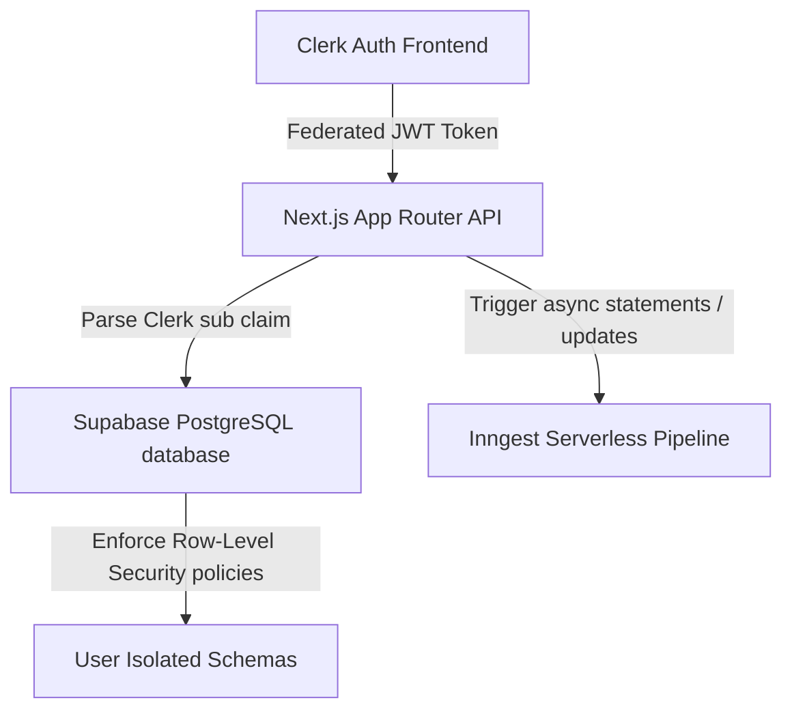
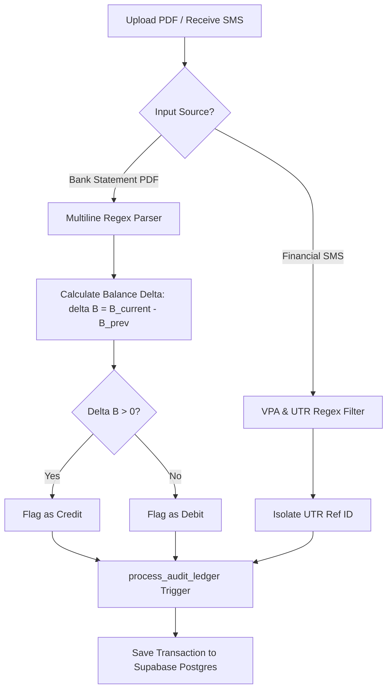
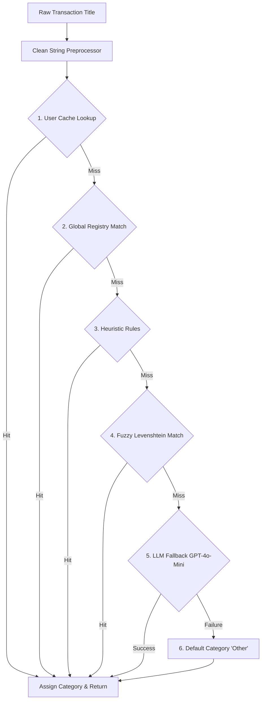

# FinTrac AI - Comprehensive Feature & Heuristics Reference (v2)

This reference document compiles the platform architecture, database schemas, processing pipelines, fuzzy matching rules, and UI architectures implemented across **FinTrac AI**.

---

## 1. Core Platform Architecture & System Stack

FinTrac AI is built on a modern Next.js 14 App Router SaaS stack, featuring serverless background event pipelines, federated authentication, and Row-Level Security.



---

## 2. Authentication, Identity Federations, & Database Isolation

FinTrac AI isolates user accounts and records through a federated identity setup linking **Clerk** with **Supabase Row-Level Security (RLS)**.

### 2.1 Clerk Token SQL JWT Resolver
Supabase intercepts Clerk authentication tokens via middleware. To check identity on every database row lookup without external network roundtrips, we define a lightweight SQL function that reads the decrypted JWT session payload claims:
```sql
CREATE OR REPLACE FUNCTION public.clerk_user_id()
RETURNS TEXT AS $$
  SELECT nullif(current_setting('request.jwt.claims', true)::json->>'sub', '')::text;
$$ LANGUAGE sql STABLE SECURITY DEFINER;
```

### 2.2 RLS Schema Isolation Policies
Using `public.clerk_user_id()`, RLS policies guard write and read scopes on every table:
- **`behavioral_profiles` Isolation Rule**:
  ```sql
  CREATE POLICY "Users can only read their own profile"
  ON public.behavioral_profiles FOR SELECT
  USING (user_id = public.clerk_user_id());
  ```
- **`transactions` Isolation Rule**:
  ```sql
  CREATE POLICY "Transactions RLS filter"
  ON public.transactions FOR ALL
  USING (user_id = public.clerk_user_id());
  ```

---

## 3. Bank Statement Ingestion & Text Processing Pipelines

Statement ingestion routes uploads through regex parsers that digest multi-page text blocks.



### 3.1 Regex-Based Multi-Line Transaction Boundary Matching
Bank statements wrap dates, merchant names, amounts, and balances across newlines. The parser isolates individual transaction bounds using:
- **Opening Date Identifier**:
  $$\text{Regex}_{\text{start}} = \texttt{\textasciicircum\textbackslash{}d+\textbackslash{}s+(\textbackslash{}d\{1,2\}\textbackslash{}s+[A-Za-z]\{3\}\textbackslash{}s+\textbackslash{}d\{4\}|\textbackslash{}d\{1,2\}[/\textbackslash{}\-]\textbackslash{}d\{1,2\}[/\textbackslash{}\-]\textbackslash{}d\{2,4\})\textbackslash{}b}$$
- **Closing Numeric / Decimal Amount Boundary**:
  $$\text{Regex}_{\text{end}} = \texttt{[\textbackslash{}\-+]?[\textbackslash{}d,]+\textbackslash{}.\textbackslash{}d\{2\}\textbackslash{}s+[\textbackslash{}\-+]?[\textbackslash{}d,]+\textbackslash{}.\textbackslash{}d\{2\}\textbackslash{}s*\$}$$

### 3.2 Balance Delta Debit/Credit Mechanics
To resolve credit vs. debit flags when statement rows do not state the direction explicitly, the pipeline monitors the running balance difference:
$$\Delta B = B_{\text{current}} - B_{\text{previous}}$$
$$\text{Direction} = \begin{cases} 
      \text{Credit (Income)} & \text{if } \Delta B > 0 \\
      \text{Debit (Expense)} & \text{if } \Delta B < 0 
   \end{cases}$$

### 3.3 SMS Sync UPI Merchant Extraction
SMS updates sent from the Android CLI Sync service strip VPAs, transaction refs, and city codes from descriptions:
- **VPA Filter Pattern**: `[\w.-]+@[\w.-]+` $\rightarrow$ removed.
- **UTR 12-Digit Reference Pattern**: `\b\d{12}\b` $\rightarrow$ isolated as transaction ID.

---

## 4. 8-Stage Hybrid Transaction Classification Pipeline

Transactions are classified through an 8-stage hybrid pipeline to balance execution speed, database caching, and natural language categorization:



### 4.1 Local Cache Lookup
First checks the user's personal Merchant Override Cache (`merchant_memory` table) for past manual corrections.

### 4.2 Global Registry Lookup
Matches clean merchant strings against the system-wide merchant classification table.

### 4.3 Heuristic Rule Engines
Evaluates common patterns (e.g., checks if transaction includes keywords like "Rent", "Salary", "Interest" and has specific transaction amounts to directly assign categories).

### 4.4 Fuzzy Levenshtein Matching (Fuse.js)
Calculates string similarities between merchant names. Matches with a Levenshtein score above threshold are categorized immediately.

### 4.5 LLM Fallback (GPT-4o-Mini)
For unknown merchants, calls the OpenRouter LLM using structured JSON schemas:
```json
{
  "category": "Dining" | "Shopping" | "Subscriptions" | "Entertainment" | "Other",
  "confidence": 0.0 - 1.0,
  "rationale": "Brief justification text"
}
```

---

## 5. Cryptographic Blockchain Audit Ledger

To prevent retrospective expense alteration or tax logs tampering, transaction inserts trigger a cryptographic ledger chain.

### 5.1 SQL SHA-256 Ledger Trigger
When a transaction is inserted, the database executes:
$$\text{Hash}_n = \text{SHA256}(\text{Hash}_{n-1} \parallel \text{ID}_n \parallel \text{Amount}_n \parallel \text{Date}_n)$$

```sql
CREATE OR REPLACE FUNCTION public.process_audit_ledger()
RETURNS TRIGGER AS $$
DECLARE
  prev_hash TEXT;
BEGIN
  -- Fetch the hash of the user's previous transaction block
  SELECT current_hash INTO prev_hash
  FROM public.transactions
  WHERE user_id = NEW.user_id AND id < NEW.id
  ORDER BY id DESC LIMIT 1;

  -- Fallback to genesis block if first insert
  IF prev_hash IS NULL THEN
    prev_hash := encode(sha256(('genesis_block_' || NEW.user_id)::bytea), 'hex');
  END IF;

  -- Compute new hash chain node
  NEW.current_hash := encode(sha256((prev_hash || NEW.id::text || NEW.amount::text || NEW.created_at::text)::bytea), 'hex');
  
  RETURN NEW;
END;
$$ LANGUAGE plpgsql;
```

---

## 6. Behavioral Coaching Engine & Tabbed Simulator UI

### 6.1 Dynamic Savings Allocator
Categorical savings recommendations are distributed inversely proportional to estimated user friction weights:
$$X_{t, c} = T_t \cdot \frac{\left( 1.0 - F_{t, c} \right)^2}{\sum_{c'} \left( 1.0 - F_{t, c'} \right)^2}$$

### 6.2 UI budget Page & Tabbed Simulator
- **Budget optimizer tab**: Renders progress rings, categorical savings gauges, and slider controls to adjust the total target $T_t$.
- **Friction simulator tab**: Allows the user to simulate monthly overruns in category friction to watch how the RL weights adapt, mapping predicted user compliance paths.
