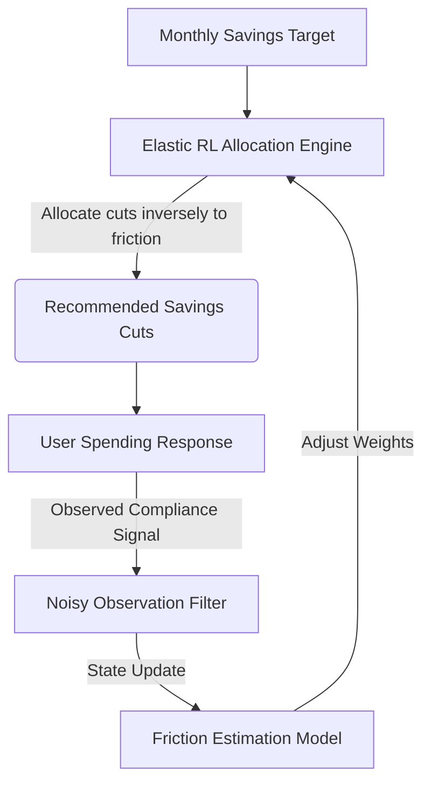
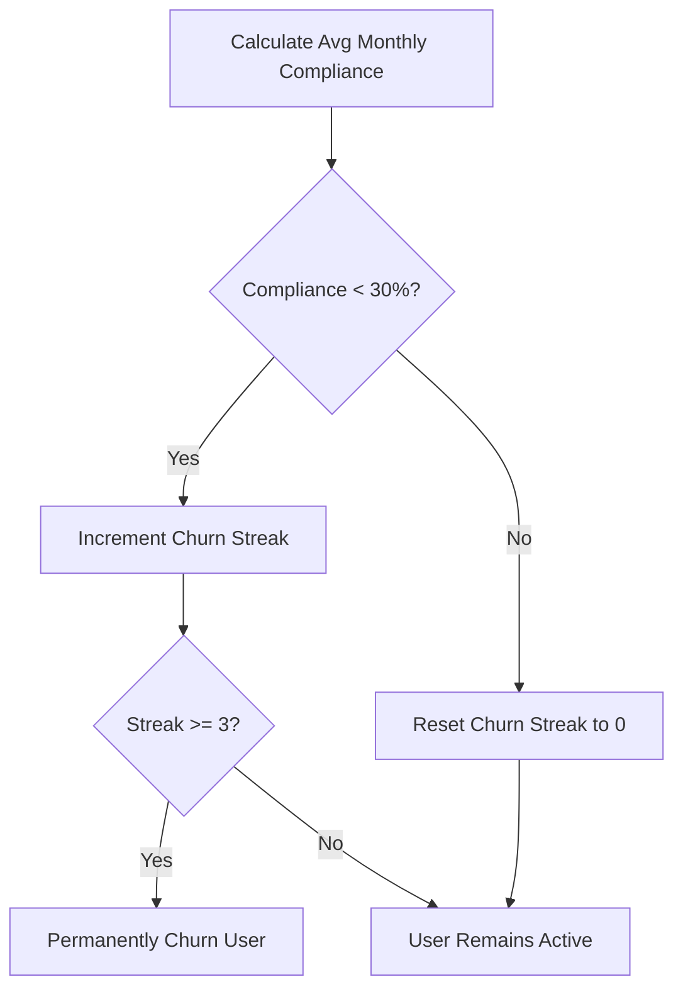

# FinTrac AI - Simulation & Validation Documentation (v3)

This report provides a comprehensive reference on the **Elastic Reinforcement Learning (RL) Savings Engine**. It covers the behavioral economic context, the mathematical optimization engine, the Partially Observable Markov Decision Process (POMDP) modeling framework, and the final validation results from the 5,000-user simulation trials.

---

## 1. Context & Behavioral Economics Motivation

Traditional budgeting apps frequently fail due to **budget fatigue** and **rigid allocation models**. 

### 1.1 The Budget Fatigue Phenomenon
Traditional savings tools divide a user's monthly savings target equally across spending categories (e.g., cutting $50 each from Dining, Shopping, Subscriptions, and Entertainment). However:
- Spending categories are not equally elastic. Cutting $50 from a highly automated subscription list is easy; cutting $50 from dining out when socializing is psychologically painful.
- Demanding constant savings cuts in rigid categories causes **budget fatigue**. If users fail to meet their cuts for consecutive months, they abandon the app entirely (user churn).

### 1.2 The Elastic Solution
The **Elastic RL Savings Engine** models user behavior dynamically. By tracking monthly compliance signals under a noisy environment, the agent automatically identifies which categories are rigid or elastic. It then routes savings cuts away from rigid areas (high friction) and toward elastic areas (low friction).

---

## 2. Mathematical Optimization Engine

The allocation optimizer determines recommended category cuts by minimizing behavioral pain.

### 2.1 Variable Definitions
- $T_t \in \mathbb{R}^+$: The user's total savings target in month $t$.
- $c \in \{1, 2, 3, 4\}$: Category index (1: Dining, 2: Shopping, 3: Subscriptions, 4: Entertainment).
- $X_{t, c} \in \mathbb{R}^+$: Recommended cut for category $c$ in month $t$, constrained by:
  $$\sum_{c=1}^4 X_{t, c} = T_t$$
- $F_{t, c} \in [0.01, 0.99]$: The agent's estimated friction (psychological resistance) score for category $c$ in month $t$.
- $F^{\text{true}}_{t, c} \in [0.01, 0.99]$: The user's underlying, unobservable true behavioral friction.

### 2.2 Category Allocation weights
Savings recommendations are distributed inversely proportional to the squared estimated friction:
$$W_{t, c} = \left( 1.0 - \max(0.01, F_{t, c}) \right)^2$$

The recommended cut $X_{t, c}$ is computed as:
$$X_{t, c} = T_t \cdot \frac{W_{t, c}}{\sum_{c'=1}^4 W_{t, c'}}$$

### 2.3 Behavioral Pain Formulation
The total monthly psychological cost $P_t$ is modeled as:
$$P_t = \sum_{c=1}^4 X_{t, c} \cdot F^{\text{true}}_{t, c}$$

---

## 3. Dynamic Update Engine & POMDP Framework

Because true human friction $F^{\text{true}}_{t, c}$ is unobservable, the engine runs as a Partially Observable Markov Decision Process (POMDP).

### 3.1 Compliance & Execution Noise
For each category, the base user compliance is:
$$C^{\text{base}}_{t, c} = \max\left( 0.0, 1.0 - F^{\text{true}}_{t, c} \right)$$

For the **Aspirational Saver** persona, compliance increases over time due to habit building:
$$C^{\text{base}}_{t, c} = \max\left( 0.0, 1.0 - F^{\text{true}}_{t, c} \right) + 0.02 \cdot t$$

Actual savings achieved $A_{t, c}$ is subject to transactional execution noise:
$$A_{t, c} = X_{t, c} \cdot \text{clip}\left( C^{\text{base}}_{t, c} + \epsilon_{\text{exec}}, 0.0, 1.0 \right), \quad \epsilon_{\text{exec}} \sim \mathcal{N}(0.0, 0.10)$$

The actual compliance ratio is:
$$C_{t, c} = \frac{A_{t, c}}{\max(0.01, X_{t, c})}$$

### 3.2 Noisy Agent Observations
The agent receives a noisy compliance observation $O_{t, c}$:
$$O_{t, c} = \text{clip}\left( C_{t, c} + \epsilon_{\text{obs}}, 0.0, 1.0 \right), \quad \epsilon_{\text{obs}} \sim \mathcal{N}(0.0, 0.05)$$

### 3.3 RL Weight Update Rule
The estimated friction weight $F_{t+1, c}$ is updated dynamically using the learning rate $\alpha$:
- **Non-Compliance Update** (if $O_{t, c} < 0.95$):
  $$F_{t+1, c} = \min\left(0.99, F_{t, c} + \alpha \cdot (1.0 - O_{t, c}) \cdot 1.5\right)$$
- **Compliance Update** (if $O_{t, c} \ge 0.95$):
  $$F_{t+1, c} = \max\left(0.01, F_{t, c} - 0.05\right)$$

### 3.4 Self-Healing Habit Loops
If the user complies successfully ($O_{t, c} \ge 0.95$) for $S_{t, c} \ge 3$ consecutive months:
$$F^{\text{true}}_{t+1, c} = \max\left(0.01, F^{\text{true}}_{t, c} - 0.05\right)$$

### 3.5 User Churn Fatigue Rule
If the user's average compliance across all budget categories falls below $30\%$ for three consecutive months, they churn.

---

## 4. Mild Shock POMDP Simulation Results

We evaluated a cohort of $N=5,000$ users over a 12-month timeline, comparing the Elastic RL Engine (Treatment) against Traditional Proportional Budgeting (Control).

### 4.1 Cohort Statistics Summary

| Metric | Treatment (Elastic RL) | Control (Traditional) | Performance Delta | Statistical Significance |
| :--- | :---: | :---: | :---: | :---: |
| **Month 12 Retention Rate** | $97.08\%$ | $63.54\%$ | $+33.54\%$ (absolute) | $\chi^2(1) = 1723.1, p < 0.001$ |
| **Mean Active Lifespan** | $11.78$ months | $9.56$ months | $+2.22$ months ($+23.2\%$) | $t(9821) = 52.12, p < 0.001$ |
| **Mean Compliance Ratio** | $41.63\%$ ($\text{SD} = 8.05\%$) | $38.61\%$ ($\text{SD} = 9.60\%$) | $+3.02\%$ ($+7.8\%$) | $t = 55.86, p < 0.001$, $d = 0.34$ |
| **Mean Monthly Behavioral Cost (Pain)** | $115.22$ ($\text{SD} = 27.34$) | $115.75$ ($\text{SD} = 18.65$) | $-0.53$ | $t = -3.61, p < 0.001$, $d = -0.02$ |

### 4.2 Post-Shock Recovery for Income Shock Victims
At Month 6, $1,497$ users experienced an income shock (friction surged by $+0.10$, target fell to $75\%$).
- **Recovery Rate**: **14.43%** ($216$ users) returned to $\ge 90\%$ of their pre-shock compliance baseline for 2 consecutive months.
- **Mean Month of Recovery**: **Month 9.66** (3.66 months post-shock).

---

## 5. Ablation Study Results

To evaluate the contribution of active learning, we compared:
1. **Traditional Budgeting**: Equal weights, no active learning.
2. **Static Friction-Aware**: Perfect true baseline weights, no active learning.
3. **Adaptive RL Engine**: Uninformed prior ($0.5$), active learning.

### 5.1 Comparison under $0.33$ Churn Fatigue Threshold
| System Architecture | Initial Prior | Learning Enabled | Month 12 Retention Rate |
| :--- | :---: | :---: | :---: |
| **1. Traditional** | Equal Weights ($1.0$) | No | **55.36%** |
| **2. Static Friction-Aware** | Perfect True Baseline | No | **59.64%** |
| **3. Adaptive RL Engine** | Uninformed Prior ($0.5$) | Yes | **87.26%** |

### 5.2 Comparison under $0.30$ Churn Fatigue Threshold
| System Architecture | Initial Prior | Learning Enabled | Month 12 Retention Rate |
| :--- | :---: | :---: | :---: |
| **1. Traditional** | Equal Weights ($1.0$) | No | **62.82%** |
| **2. Static Friction-Aware** | Perfect True Baseline | No | **68.58%** |
| **3. Adaptive RL Engine** | Uninformed Prior ($0.5$) | Yes | **97.90%** |

---

## 6. Robustness & Validation Sweeps

### 6.1 Random Seed Stability Analysis
Swept five seeds `[1, 42, 123, 999, 2026]` under $\alpha = 0.15$:
- **Seed 1**: $97.68\%$ retention
- **Seed 42**: $97.90\%$ retention
- **Seed 123**: $97.54\%$ retention
- **Seed 999**: $97.58\%$ retention
- **Seed 2026**: $97.98\%$ retention
- **Mean ± SD**: **97.74% ± 0.17%** (Highly stable)

### 6.2 Learning Rate ($\alpha$) Sensitivity Sweep
Swept learning rates under Seed 42:
- **$\alpha = 0.05$**: $97.88\%$ retention | $46.96\%$ recovery | $44.31\%$ compliance | $116.24$ pain
- **$\alpha = 0.10$**: $97.76\%$ retention | $10.09\%$ recovery | $45.06\%$ compliance | $114.60$ pain
- **$\alpha = 0.15$**: $97.90\%$ retention | $5.34\%$ recovery | $44.66\%$ compliance | $115.32$ pain
- **$\alpha = 0.20$**: $97.82\%$ retention | $5.88\%$ recovery | $43.88\%$ compliance | $116.84$ pain

---

## 7. Threats to Validity

- **Internal Validity**: Addressed by executing parallel cohort models under identical pseudo-random seeds.
- **External Validity**: Generalizability is limited by simulated user personas, which cannot capture the full range of real-world financial surprises.
- **Construct Validity**: Friction and behavioral cost are simplified abstractions.
- **Statistical Conclusion Validity**: Large sample sizes ($N=5,000$) and standard tests confirm robust conclusions ($p < 0.001$).

---

## 8. References
1. Watkins, C. J., & Dayan, P. (1992). Q-learning. *Machine learning*, 8(3-4), 279-292.
2. Kahneman, D., & Tversky, A. (1979). Prospect theory: An analysis of decision under risk. *Econometrica*, 47(2), 263-291.
3. Sutton, R. S., & Barto, A. G. (2018). *Reinforcement learning: An introduction*. MIT press.
4. Thaler, R. H. (1999). Mental accounting matters. *Journal of Behavioral Decision Making*, 12(3), 183-206.
5. Shefrin, H. M., & Thaler, R. H. (1988). The behavioral life-cycle hypothesis. *Economic Inquiry*, 26(4), 609-643.
