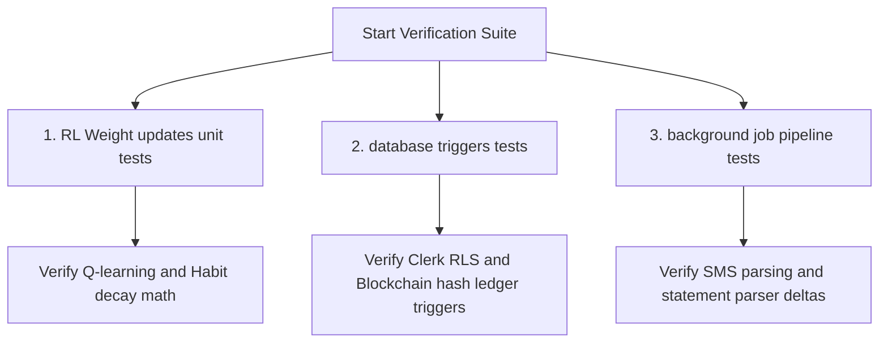
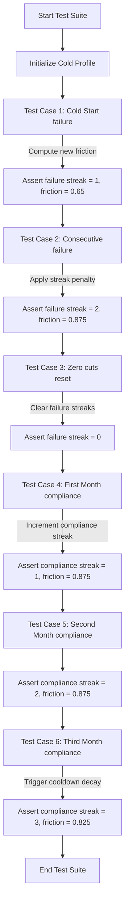
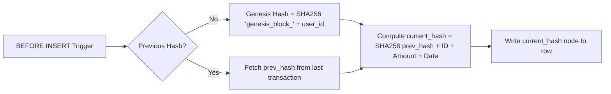

# FinTrac AI - Verification & Testing Documentation (v2)

This document details the testing architecture, database triggers, unit tests, and background job verification steps built within **FinTrac AI**. It records how we mathematically verify the reinforcement learning updates, Row-Level Security isolation, and transaction auditing ledger triggers.

---

## 1. Testing Framework Overview

FinTrac AI employs a split verification approach to ensure that the core reinforcement learning weights, security parameters, and data pipelines behave deterministically.

---

## 2. Reinforcement Learning Friction Updates Unit Tests

The core validation suite for the RL friction updates is located at [runFrictionUpdatesTests.ts](file:///C:/Users/zaids/.gemini/antigravity/scratch/fintrac-ai-landing/src/lib/ai/runFrictionUpdatesTests.ts) and is run using `npx ts-node`.

### 2.1 Mathematical Formulation of Test Assertions

Let $F_t$ represent the estimated friction for a category in month $t$, $S^{\text{fail}}_t$ represent the failure streak, and $S^{\text{comp}}_t$ represent the compliance streak. The unit tests verify four distinct behavioral scenarios:

#### Scenario A: Cold Start Behavior (Initial Prior)
When a category is unprofiled, the system defaults to a neutral prior:
$$F_0 = 0.50, \quad S^{\text{fail}}_0 = 0, \quad S^{\text{comp}}_0 = 0$$
For a suggested savings cut $X_1 = 2000$ and actual savings $A_1 = 0$ (compliance $C_1 = 0$):
- **Failure Streak**: $S^{\text{fail}}_1 = S^{\text{fail}}_0 + 1 = 1$
- **Compliance Streak**: $S^{\text{comp}}_1 = 0$
- **Friction Penalty**:
  $$F_1 = F_0 + \alpha \cdot (1.0 - C_1) \cdot \left(1.0 + 0.5 \cdot S^{\text{fail}}_0\right) = 0.50 + 0.15 \cdot (1.0 - 0.0) \cdot 1.0 = 0.65$$

#### Scenario B: Consecutive Failure with Streak Penalty
If the user ignores a cut $X_2 = 1400$ again in month 2 ($C_2 = 0$):
- **Failure Streak**: $S^{\text{fail}}_2 = S^{\text{fail}}_1 + 1 = 2$
- **Friction Penalty**:
  $$F_2 = F_1 + \alpha \cdot (1.0 - C_2) \cdot \left(1.0 + 0.5 \cdot S^{\text{fail}}_1\right) = 0.65 + 0.15 \cdot (1.0 - 0.0) \cdot 1.5 = 0.875$$

#### Scenario C: Zero Recommendations Reset
If the system recommends a suggested cut $X_3 = 0$ in month 3, the user's failure streak is reset to zero to prevent historical fatigue propagation:
- **Failure Streak**: $S^{\text{fail}}_3 = 0$

#### Scenario D: Cooldown Threshold and Decay
When the user complies perfectly ($C_t = 1.0$) for consecutive months:
- **Month 4 ($C_4 = 1.0$)**: $S^{\text{comp}}_4 = 1, \quad F_4 = F_3 = 0.875$ (no decay before threshold)
- **Month 5 ($C_5 = 1.0$)**: $S^{\text{comp}}_5 = 2, \quad F_5 = F_4 = 0.875$ (no decay before threshold)
- **Month 6 ($C_6 = 1.0$)**: $S^{\text{comp}}_6 = 3 \ge \text{recovery\_threshold}$ (decay triggered):
  $$F_6 = \max\left(0.0, F_5 - \text{decay\_rate}\right) = 0.875 - 0.05 = 0.825$$

### 2.2 Execution Control Flow

### 2.3 Test Case Matrix & Assertions

| Test Case | Month | Suggested Cut ($X$) | Actual achieved ($A$) | Compliance ($C$) | Failure Streak | Compliance Streak | Friction Score | Assertion Verified |
| :--- | :---: | :---: | :---: | :---: | :---: | :---: | :---: | :--- |
| **1. Cold Start** | 1 | $2,000$ | $0$ | $0.00$ | $1$ | $0$ | $0.6500$ | `Shopping failure sets streak = 1, friction = 0.65` |
| **2. Consecutive Fail** | 2 | $1,400$ | $0$ | $0.00$ | $2$ | $0$ | $0.8750$ | `Streak penalty accelerates friction to 0.875` |
| **3. Zero Reset** | 3 | $0$ | $0$ | $1.00$ | $0$ | $0$ | $0.8750$ | `Zero suggested cut clears failure streak` |
| **4. Compliance M1** | 4 | $500$ | $500$ | $1.00$ | $0$ | $1$ | $0.8750$ | `Compliance streak increments to 1; no decay` |
| **5. Compliance M2** | 5 | $500$ | $500$ | $1.00$ | $0$ | $2$ | $0.8750$ | `Compliance streak increments to 2; no decay` |
| **6. Cooldown Decay** | 6 | $500$ | $500$ | $1.00$ | $0$ | $3$ | $0.8250$ | `Compliance streak = 3 triggers decay (-0.05)` |

---

## 3. Database Schema Triggers & Security isolation Verification

### 3.1 Cryptographic Audit Ledger trigger
To guarantee transaction history immutability, database triggers recalculate a running SHA-256 hash for every transaction block:
$$\text{Hash}_n = \text{SHA256}(\text{Hash}_{n-1} \parallel \text{ID}_n \parallel \text{Amount}_n \parallel \text{Date}_n)$$

The blockchain trigger validates hashes sequentially on inserts.

#### Verification Steps:
1. **Insert verification**: Check that inserting a new transaction automatically generates a `current_hash`.
2. **Chain integrity check**: Verify that the generated hash depends directly on the `current_hash` of the parent transaction (ordered by `id`).
3. **Immutability verification**: Any attempt to perform an `UPDATE` or `DELETE` on transaction rows must fail or break the chain validation scripts.

### 3.2 Clerk JWT Row-Level Security (RLS) Isolation
Database tables enforce RLS using the resolver `public.clerk_user_id()`.
- **Select Isolation Test**: Running `SELECT * FROM public.transactions` under User A's token context must return exactly User A's rows.
- **Cross-Insert Block Test**: User A attempting to insert a row with `user_id = 'user_B'` must be rejected by the RLS policy constraints.

---

## 4. Background Job & parsing pipelines Verification

### 4.1 Bank Statement parsing deltas
- **Statement parser boundary validation**: Test statements containing split transaction dates and multi-line names are parsed using regex checks.
- **Directional delta math validation**: Verifies credit/debit calculation by comparing balance deltas:
  $$\Delta B = B_{\text{current}} - B_{\text{previous}}$$
  If $\Delta B > 0$, transaction must be flagged as a `credit`; if $\Delta B < 0$, it must be flagged as a `debit`.

### 4.2 Monthly Friction Update Job Scheduler
- **Job Trigger validation**: Verifies Inngest scheduler calls friction weight update scripts on cron tick.
- **Historical Budget Logging**: Verifies recommended limits are saved to `historical_budgets` database for telemetry.
