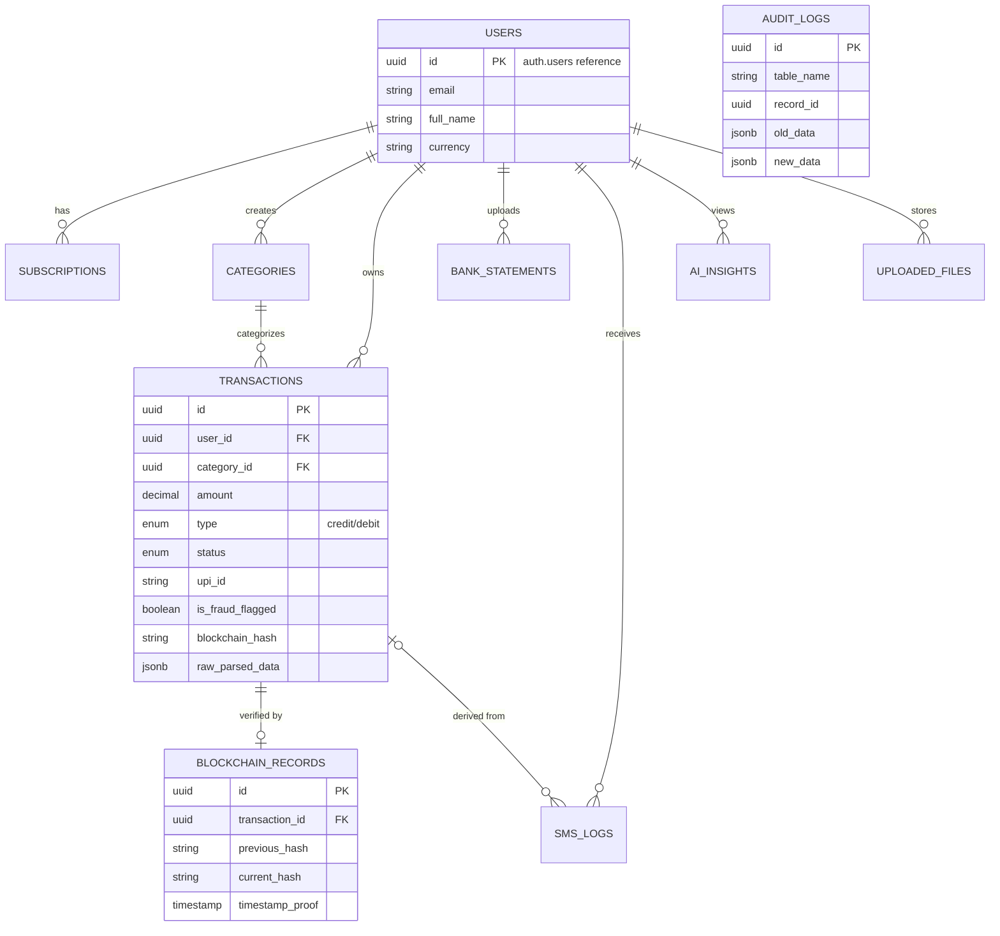

# Fintrac AI - Supabase Database Architecture

This document provides a comprehensive overview of the database architecture designed for Fintrac AI, a fintech SaaS product built on Next.js, OpenRouter, and Supabase.

## Overview

The database is built on PostgreSQL (via Supabase) and features 10 core tables designed to handle millions of transactions securely, accurately, and scalably. 

Key architectural components include:
1. **Core Relational Entities**: Strongly typed schemas for Users, Transactions, Subscriptions, and Categorization.
2. **Fintech Auditing**: Trigger-based audit logs for every transaction mutation (insert, update, delete).
3. **Immutability (Blockchain Emulation)**: Cryptographic hash-chaining for transactions ensuring timestamp proofs and tamper-evidence.
4. **Data Isolation (RLS)**: Strict Supabase Row Level Security (RLS) guaranteeing that users can only access their own data.
5. **AI Ingestion Models**: JSONB and raw text ingestion for Bank Statements and SMS logs, preparing for Edge Function extraction.

---

## 1. Schema Design (ERD Diagram)



---

## 2. Ingestion & Processing Pipeline

Fintrac AI supports automated insights across various ingestion methods:

### SMS Log Ingestion
1. **Client App**: Reads financial SMS and pushes to `sms_logs` table via Supabase client.
2. **Edge Function Trigger**: Supabase Database Webhook triggers an Edge Function on `sms_logs` INSERT.
3. **AI Parsing**: The Edge function uses OpenRouter to parse the SMS into a standardized JSON object.
4. **Transaction Creation**: Edge function inserts the clean payload into `transactions`.
5. **Audit & Hash**: Postgres Triggers automatically generate an Audit Log entry and compute the Blockchain cryptographic hash.

### Bank Statement (PDF/CSV) Ingestion
1. **Upload**: User uploads document to Supabase Storage bucket.
2. **Record Creation**: Frontend writes a tracking record in `bank_statements` and `uploaded_files`.
3. **Processing Worker**: A background worker (or Edge Function) reads the file, parses it (via AI/OCR), and creates bulk `transactions`.

---

## 3. Next.js App Router API Recommendations

To securely integrate this database with Next.js App Router, follow these patterns:

- **Server Actions & Route Handlers**: Use `@supabase/ssr` to securely interact with the database on the server, ensuring RLS policies apply correctly based on the user's active session cookie.
- **Service Role Bypassing**: When triggering AI tasks from Edge Functions that need to write to arbitrary user tables (like appending `ai_insights`), use the Supabase `service_role` key inside the Edge Function. This bypasses RLS securely inside the server environment.

```typescript
// Example: Creating a transaction in Next.js Server Action
import { createClient } from '@/utils/supabase/server';

export async function addTransaction(data) {
  const supabase = createClient();
  const { data: user } = await supabase.auth.getUser();
  
  if (!user) throw new Error("Unauthorized");

  const { error } = await supabase
    .from('transactions')
    .insert({
      user_id: user.id,
      amount: data.amount,
      type: data.type,
      merchant_name: data.merchant,
      date: new Date().toISOString()
    });
    
  // The PostgreSQL trigger will automatically compute the blockchain_hash and write the audit_log
}
```

---

## 4. Scalability & Best Practices

1. **UUIDv4 Primary Keys**: Using UUIDs distributes writes across B-tree index pages, preventing hot spots typical in auto-incrementing integers.
2. **GIN Indexes on JSONB**: We utilize GIN indexes on the `raw_parsed_data` column. This means AI models can dump unstructured JSON into the database, and we can still query it instantly (`transactions @> '{"bank": "HDFC"}'`).
3. **Partitioning Strategy (Future)**: As Fintrac AI approaches >10M rows in `transactions` or `audit_logs`, consider Table Partitioning by `date` (e.g., partitioning `audit_logs` by month).
4. **Realtime Architecture**: Use Supabase Realtime subscriptions on the `ai_insights` table. When an Edge Function finishes analyzing spending and writes a new insight, the Next.js frontend can listen for it and pop up an alert instantly.

```typescript
// Realtime Subscription Example
supabase
  .channel('insights-channel')
  .on(
    'postgres_changes',
    { event: 'INSERT', schema: 'public', table: 'ai_insights', filter: `user_id=eq.${userId}` },
    (payload) => {
      toast("New Financial Insight Available!");
    }
  )
  .subscribe()
```
